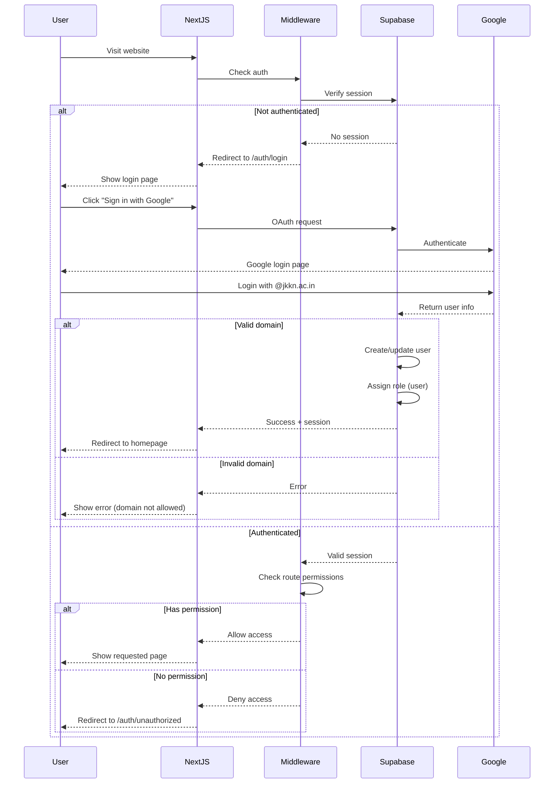

# Product Requirements Document (PRD)
## JKKN Institution Admin Panel & User Management System

---

## 1. Executive Summary

### 1.1 Project Name
JKKN Institution Admin Panel with Domain-Restricted Access Control

### 1.2 Objective
Develop a comprehensive admin panel with Google OAuth authentication restricted to @jkkn.ac.in domain users, enabling secure access control to the JKKN Institution website and providing administrators with tools to manage users, content, inquiries, and analytics.

### 1.3 Key Features
- Google OAuth authentication restricted to @jkkn.ac.in domain
- Auto-approval for verified domain users
- Role-based access control (User/Admin)
- User management dashboard
- Content management system (CMS)
- Form submission management
- Analytics and reporting dashboard
- Full website navigation accessible within admin panel

### 1.4 Technology Stack
- **Frontend**: Next.js 15 (App Router) with TypeScript
- **Backend**: Supabase (PostgreSQL, Authentication, Storage, Real-time)
- **Styling**: Tailwind CSS
- **UI Components**: Shadcn/ui
- **Authentication**: Supabase Auth with Google OAuth Provider
- **Analytics**: Supabase Analytics + Google Analytics 4
- **Deployment**: Vercel

---

## 2. System Architecture

### 2.1 High-Level Architecture

```
┌─────────────────────────────────────────────────────────┐
│                    Next.js 15 Frontend                   │
├─────────────────────────────────────────────────────────┤
│  ┌──────────────┐  ┌──────────────┐  ┌──────────────┐  │
│  │  Public Pages │  │  Admin Panel │  │ Auth Pages   │  │
│  │  (Protected)  │  │ (Admin Only) │  │ (Login/etc)  │  │
│  └──────────────┘  └──────────────┘  └──────────────┘  │
└─────────────────────────────────────────────────────────┘
                          ↓
┌─────────────────────────────────────────────────────────┐
│              Middleware Layer (Auth Check)               │
│  - Domain validation (@jkkn.ac.in)                      │
│  - Role-based access control                            │
│  - Session management                                    │
└─────────────────────────────────────────────────────────┘
                          ↓
┌─────────────────────────────────────────────────────────┐
│                    Supabase Backend                      │
├─────────────────────────────────────────────────────────┤
│  ┌──────────────┐  ┌──────────────┐  ┌──────────────┐  │
│  │   Auth       │  │  PostgreSQL  │  │   Storage    │  │
│  │   (Google)   │  │   Database   │  │   (Files)    │  │
│  └──────────────┘  └──────────────┘  └──────────────┘  │
└─────────────────────────────────────────────────────────┘
```

### 2.2 Route Structure

```
/                          # Homepage (requires @jkkn.ac.in auth)
├── /about                 # Public pages (auth required)
├── /admission
├── /placements
├── /facilities
├── /career
├── /contact
│
/auth                      # Authentication pages
├── /auth/login           # Login with Google
├── /auth/error           # Auth error page
├── /auth/unauthorized    # Access denied page
│
/admin                     # Admin panel (admin role required)
├── /admin/dashboard      # Main admin dashboard
├── /admin/users          # User management
│   ├── /admin/users/list
│   ├── /admin/users/[id]
│   └── /admin/users/activity-logs
│
├── /admin/content        # Content management
│   ├── /admin/content/announcement
│   ├── /admin/content/hero
│   ├── /admin/content/benefits
│   ├── /admin/content/statistics
│   ├── /admin/content/videos
│   └── /admin/content/contact-info
│
├── /admin/inquiries      # Form submissions
│   ├── /admin/inquiries/pending
│   ├── /admin/inquiries/resolved
│   └── /admin/inquiries/[id]
│
├── /admin/analytics      # Analytics dashboard
├── /admin/media          # Media library
├── /admin/settings       # Admin settings
└── /admin/preview        # Website preview/navigation
```

### 2.3 Component Architecture

**Shared Components:**
- Navigation (with auth state)
- Footer
- Loading states
- Error boundaries

**Admin-Specific Components:**
- Admin sidebar navigation
- Data tables with sorting/filtering
- Chart components for analytics
- File upload components
- Rich text editor for content
- Modal dialogs
- Toast notifications

---

## 3. Authentication & Authorization

### 3.1 Authentication System

**Provider:** Google OAuth via Supabase Auth

**Domain Restriction:** @jkkn.ac.in only

**Implementation:**
```typescript
// Supabase configuration
const supabaseUrl = process.env.NEXT_PUBLIC_SUPABASE_URL
const supabaseAnonKey = process.env.NEXT_PUBLIC_SUPABASE_ANON_KEY

// Google OAuth with domain restriction
await supabase.auth.signInWithOAuth({
  provider: 'google',
  options: {
    redirectTo: `${origin}/auth/callback`,
    queryParams: {
      hd: 'jkkn.ac.in' // Hosted domain restriction
    }
  }
})
```

### 3.2 User Roles

| Role | Access Level | Permissions |
|------|-------------|-------------|
| **User** | Public website access | - View all public pages<br>- Submit contact forms<br>- View own profile |
| **Admin** | Full system access | - All user permissions<br>- Access admin panel<br>- Manage users<br>- Manage content<br>- View analytics<br>- Manage inquiries |
| **Super Admin** | System administration | - All admin permissions<br>- Create/delete admins<br>- System settings<br>- Database backups |

### 3.3 Authentication Flow



### 3.4 Session Management

- **Session Duration:** 7 days (configurable)
- **Refresh Token:** Automatic refresh before expiry
- **Concurrent Sessions:** Allowed (max 3 devices)
- **Session Storage:** HTTP-only cookies
- **CSRF Protection:** Built-in with Supabase

### 3.5 Middleware Protection

```typescript
// middleware.ts
export async function middleware(request: NextRequest) {
  const { supabase, response } = createMiddlewareClient({ request })

  // Refresh session if exists
  await supabase.auth.getSession()

  const {
    data: { user },
  } = await supabase.auth.getUser()

  // Protected routes
  const publicRoutes = ['/auth/login', '/auth/error']
  const adminRoutes = ['/admin']

  const path = request.nextUrl.pathname

  // Check if trying to access protected route without auth
  if (!user && !publicRoutes.some(route => path.startsWith(route))) {
    return NextResponse.redirect(new URL('/auth/login', request.url))
  }

  // Check domain restriction
  if (user && !user.email?.endsWith('@jkkn.ac.in')) {
    await supabase.auth.signOut()
    return NextResponse.redirect(new URL('/auth/unauthorized', request.url))
  }

  // Check admin access
  if (path.startsWith('/admin')) {
    const { data: profile } = await supabase
      .from('profiles')
      .select('role')
      .eq('id', user.id)
      .single()

    if (profile?.role !== 'admin' && profile?.role !== 'super_admin') {
      return NextResponse.redirect(new URL('/auth/unauthorized', request.url))
    }
  }

  return response
}
```

---

## 4. Database Schema

### 4.1 Tables

#### profiles
```sql
CREATE TABLE profiles (
  id UUID REFERENCES auth.users(id) PRIMARY KEY,
  email TEXT UNIQUE NOT NULL,
  full_name TEXT,
  role TEXT DEFAULT 'user' CHECK (role IN ('user', 'admin', 'super_admin')),
  status TEXT DEFAULT 'active' CHECK (status IN ('active', 'blocked', 'pending')),
  avatar_url TEXT,
  department TEXT,
  created_at TIMESTAMPTZ DEFAULT NOW(),
  updated_at TIMESTAMPTZ DEFAULT NOW(),
  last_login_at TIMESTAMPTZ,
  login_count INTEGER DEFAULT 0
);

-- RLS Policies
ALTER TABLE profiles ENABLE ROW LEVEL SECURITY;

-- Users can view own profile
CREATE POLICY "Users can view own profile"
  ON profiles FOR SELECT
  USING (auth.uid() = id);

-- Admins can view all profiles
CREATE POLICY "Admins can view all profiles"
  ON profiles FOR SELECT
  USING (
    EXISTS (
      SELECT 1 FROM profiles
      WHERE id = auth.uid() AND role IN ('admin', 'super_admin')
    )
  );

-- Admins can update profiles
CREATE POLICY "Admins can update profiles"
  ON profiles FOR UPDATE
  USING (
    EXISTS (
      SELECT 1 FROM profiles
      WHERE id = auth.uid() AND role IN ('admin', 'super_admin')
    )
  );
```

#### announcements
```sql
CREATE TABLE announcements (
  id UUID DEFAULT gen_random_uuid() PRIMARY KEY,
  title TEXT NOT NULL,
  message TEXT NOT NULL,
  type TEXT DEFAULT 'info' CHECK (type IN ('info', 'warning', 'success', 'error')),
  is_active BOOLEAN DEFAULT true,
  start_date TIMESTAMPTZ,
  end_date TIMESTAMPTZ,
  created_by UUID REFERENCES profiles(id),
  created_at TIMESTAMPTZ DEFAULT NOW(),
  updated_at TIMESTAMPTZ DEFAULT NOW()
);

-- RLS Policies
ALTER TABLE announcements ENABLE ROW LEVEL SECURITY;

CREATE POLICY "Anyone can view active announcements"
  ON announcements FOR SELECT
  USING (is_active = true);

CREATE POLICY "Admins can manage announcements"
  ON announcements FOR ALL
  USING (
    EXISTS (
      SELECT 1 FROM profiles
      WHERE id = auth.uid() AND role IN ('admin', 'super_admin')
    )
  );
```

#### content_sections
```sql
CREATE TABLE content_sections (
  id UUID DEFAULT gen_random_uuid() PRIMARY KEY,
  section_key TEXT UNIQUE NOT NULL, -- 'hero', 'benefits', 'statistics'
  content JSONB NOT NULL,
  version INTEGER DEFAULT 1,
  is_published BOOLEAN DEFAULT true,
  created_by UUID REFERENCES profiles(id),
  created_at TIMESTAMPTZ DEFAULT NOW(),
  updated_at TIMESTAMPTZ DEFAULT NOW()
);

-- Example content JSONB structure for 'hero' section:
-- {
--   "title": "JKKN Institution",
--   "subtitle": "Excellence in Education",
--   "cta_text": "Explore More",
--   "cta_link": "#about",
--   "video_url": "/videos/hero-video.mp4"
-- }

-- RLS Policies
ALTER TABLE content_sections ENABLE ROW LEVEL SECURITY;

CREATE POLICY "Anyone can view published content"
  ON content_sections FOR SELECT
  USING (is_published = true);

CREATE POLICY "Admins can manage content"
  ON content_sections FOR ALL
  USING (
    EXISTS (
      SELECT 1 FROM profiles
      WHERE id = auth.uid() AND role IN ('admin', 'super_admin')
    )
  );
```

#### benefits
```sql
CREATE TABLE benefits (
  id UUID DEFAULT gen_random_uuid() PRIMARY KEY,
  title TEXT NOT NULL,
  description TEXT NOT NULL,
  icon TEXT, -- Icon name or URL
  order_index INTEGER,
  is_active BOOLEAN DEFAULT true,
  created_at TIMESTAMPTZ DEFAULT NOW(),
  updated_at TIMESTAMPTZ DEFAULT NOW()
);

-- RLS Policies
ALTER TABLE benefits ENABLE ROW LEVEL SECURITY;

CREATE POLICY "Anyone can view active benefits"
  ON benefits FOR SELECT
  USING (is_active = true);

CREATE POLICY "Admins can manage benefits"
  ON benefits FOR ALL
  USING (
    EXISTS (
      SELECT 1 FROM profiles
      WHERE id = auth.uid() AND role IN ('admin', 'super_admin')
    )
  );
```

#### statistics
```sql
CREATE TABLE statistics (
  id UUID DEFAULT gen_random_uuid() PRIMARY KEY,
  label TEXT NOT NULL,
  value TEXT NOT NULL, -- Can be number or text like "50K+"
  suffix TEXT, -- '%', '+', 'K', etc.
  icon TEXT,
  order_index INTEGER,
  is_active BOOLEAN DEFAULT true,
  created_at TIMESTAMPTZ DEFAULT NOW(),
  updated_at TIMESTAMPTZ DEFAULT NOW()
);

-- RLS Policies
ALTER TABLE statistics ENABLE ROW LEVEL SECURITY;

CREATE POLICY "Anyone can view active statistics"
  ON statistics FOR SELECT
  USING (is_active = true);

CREATE POLICY "Admins can manage statistics"
  ON statistics FOR ALL
  USING (
    EXISTS (
      SELECT 1 FROM profiles
      WHERE id = auth.uid() AND role IN ('admin', 'super_admin')
    )
  );
```

#### campus_videos
```sql
CREATE TABLE campus_videos (
  id UUID DEFAULT gen_random_uuid() PRIMARY KEY,
  title TEXT NOT NULL,
  description TEXT,
  category TEXT, -- 'campus-tour', 'library', 'sports', 'events', etc.
  video_url TEXT NOT NULL,
  thumbnail_url TEXT,
  duration INTEGER, -- in seconds
  order_index INTEGER,
  is_active BOOLEAN DEFAULT true,
  view_count INTEGER DEFAULT 0,
  uploaded_by UUID REFERENCES profiles(id),
  created_at TIMESTAMPTZ DEFAULT NOW(),
  updated_at TIMESTAMPTZ DEFAULT NOW()
);

-- RLS Policies
ALTER TABLE campus_videos ENABLE ROW LEVEL SECURITY;

CREATE POLICY "Anyone can view active videos"
  ON campus_videos FOR SELECT
  USING (is_active = true);

CREATE POLICY "Admins can manage videos"
  ON campus_videos FOR ALL
  USING (
    EXISTS (
      SELECT 1 FROM profiles
      WHERE id = auth.uid() AND role IN ('admin', 'super_admin')
    )
  );
```

#### contact_submissions
```sql
CREATE TABLE contact_submissions (
  id UUID DEFAULT gen_random_uuid() PRIMARY KEY,
  name TEXT NOT NULL,
  email TEXT NOT NULL,
  phone TEXT,
  subject TEXT,
  message TEXT NOT NULL,
  status TEXT DEFAULT 'pending' CHECK (status IN ('pending', 'in_progress', 'resolved', 'spam')),
  assigned_to UUID REFERENCES profiles(id),
  response TEXT,
  responded_at TIMESTAMPTZ,
  responded_by UUID REFERENCES profiles(id),
  submitted_by UUID REFERENCES profiles(id), -- If logged in
  ip_address TEXT,
  user_agent TEXT,
  created_at TIMESTAMPTZ DEFAULT NOW(),
  updated_at TIMESTAMPTZ DEFAULT NOW()
);

-- RLS Policies
ALTER TABLE contact_submissions ENABLE ROW LEVEL SECURITY;

CREATE POLICY "Users can view own submissions"
  ON contact_submissions FOR SELECT
  USING (submitted_by = auth.uid() OR email = (SELECT email FROM profiles WHERE id = auth.uid()));

CREATE POLICY "Admins can view all submissions"
  ON contact_submissions FOR SELECT
  USING (
    EXISTS (
      SELECT 1 FROM profiles
      WHERE id = auth.uid() AND role IN ('admin', 'super_admin')
    )
  );

CREATE POLICY "Admins can update submissions"
  ON contact_submissions FOR UPDATE
  USING (
    EXISTS (
      SELECT 1 FROM profiles
      WHERE id = auth.uid() AND role IN ('admin', 'super_admin')
    )
  );
```

#### activity_logs
```sql
CREATE TABLE activity_logs (
  id UUID DEFAULT gen_random_uuid() PRIMARY KEY,
  user_id UUID REFERENCES profiles(id),
  action TEXT NOT NULL, -- 'login', 'logout', 'update_profile', 'create_content', etc.
  entity_type TEXT, -- 'profile', 'announcement', 'video', etc.
  entity_id UUID,
  details JSONB,
  ip_address TEXT,
  user_agent TEXT,
  created_at TIMESTAMPTZ DEFAULT NOW()
);

-- RLS Policies
ALTER TABLE activity_logs ENABLE ROW LEVEL SECURITY;

CREATE POLICY "Users can view own logs"
  ON activity_logs FOR SELECT
  USING (user_id = auth.uid());

CREATE POLICY "Admins can view all logs"
  ON activity_logs FOR SELECT
  USING (
    EXISTS (
      SELECT 1 FROM profiles
      WHERE id = auth.uid() AND role IN ('admin', 'super_admin')
    )
  );

-- Admins can insert logs
CREATE POLICY "Admins can insert logs"
  ON activity_logs FOR INSERT
  WITH CHECK (
    EXISTS (
      SELECT 1 FROM profiles
      WHERE id = auth.uid() AND role IN ('admin', 'super_admin')
    )
  );
```

#### media_library
```sql
CREATE TABLE media_library (
  id UUID DEFAULT gen_random_uuid() PRIMARY KEY,
  file_name TEXT NOT NULL,
  file_path TEXT NOT NULL,
  file_type TEXT NOT NULL, -- 'image', 'video', 'document'
  mime_type TEXT NOT NULL,
  file_size BIGINT, -- in bytes
  folder TEXT DEFAULT 'root',
  alt_text TEXT,
  tags TEXT[],
  uploaded_by UUID REFERENCES profiles(id),
  created_at TIMESTAMPTZ DEFAULT NOW()
);

-- RLS Policies
ALTER TABLE media_library ENABLE ROW LEVEL SECURITY;

CREATE POLICY "Anyone can view media"
  ON media_library FOR SELECT
  USING (true);

CREATE POLICY "Admins can manage media"
  ON media_library FOR ALL
  USING (
    EXISTS (
      SELECT 1 FROM profiles
      WHERE id = auth.uid() AND role IN ('admin', 'super_admin')
    )
  );
```

### 4.2 Database Functions

#### Update last login timestamp
```sql
CREATE OR REPLACE FUNCTION update_last_login()
RETURNS TRIGGER AS $$
BEGIN
  UPDATE profiles
  SET
    last_login_at = NOW(),
    login_count = login_count + 1
  WHERE id = NEW.id;
  RETURN NEW;
END;
$$ LANGUAGE plpgsql SECURITY DEFINER;

CREATE TRIGGER on_auth_user_login
  AFTER INSERT ON auth.sessions
  FOR EACH ROW
  EXECUTE FUNCTION update_last_login();
```

#### Auto-update updated_at timestamp
```sql
CREATE OR REPLACE FUNCTION update_updated_at_column()
RETURNS TRIGGER AS $$
BEGIN
  NEW.updated_at = NOW();
  RETURN NEW;
END;
$$ LANGUAGE plpgsql;

-- Apply to all tables with updated_at
CREATE TRIGGER update_profiles_updated_at
  BEFORE UPDATE ON profiles
  FOR EACH ROW
  EXECUTE FUNCTION update_updated_at_column();

-- Repeat for other tables...
```

### 4.3 Storage Buckets

```javascript
// Supabase Storage Buckets
const buckets = [
  {
    name: 'videos',
    public: true,
    fileSizeLimit: 524288000, // 500MB
    allowedMimeTypes: ['video/mp4', 'video/webm']
  },
  {
    name: 'images',
    public: true,
    fileSizeLimit: 10485760, // 10MB
    allowedMimeTypes: ['image/jpeg', 'image/png', 'image/webp', 'image/svg+xml']
  },
  {
    name: 'documents',
    public: false,
    fileSizeLimit: 5242880, // 5MB
    allowedMimeTypes: ['application/pdf', 'application/msword']
  }
]
```

---

## 5. Admin Panel Features

### 5.1 Dashboard Overview

**Layout:**
- Sidebar navigation (collapsible on mobile)
- Top header with user profile dropdown
- Main content area with breadcrumbs
- Quick stats cards
- Recent activity feed

**Quick Stats Cards:**
- Total Users (with weekly change %)
- Active Users Today
- Pending Inquiries
- Total Page Views (last 30 days)
- New Registrations (last 7 days)
- Website Uptime Status

**Recent Activity:**
- Last 10 user logins
- Recent content updates
- Latest form submissions
- Recent admin actions

### 5.2 User Management Module

**Features:**

**5.2.1 User List View**
- Data table with columns:
  - Avatar + Full Name
  - Email
  - Role
  - Department
  - Status (Active/Blocked)
  - Last Login
  - Login Count
  - Actions (View, Edit, Block/Unblock)

- **Filters:**
  - Role filter (All/User/Admin)
  - Status filter (Active/Blocked)
  - Department filter
  - Date range filter (registration date)

- **Search:**
  - Search by name or email
  - Real-time search with debounce

- **Bulk Actions:**
  - Select multiple users
  - Bulk block/unblock
  - Export to CSV

- **Pagination:**
  - Configurable page size (10, 25, 50, 100)
  - Page navigation

**5.2.2 User Detail View**
- Complete user information
- Profile picture
- Contact details
- Role and permissions
- Account status
- Registration date
- Last login timestamp
- Login history (last 20 logins with IP and device)
- Activity log (actions performed by user)
- Actions:
  - Edit user details
  - Change role
  - Block/Unblock account
  - Reset password (send email)
  - View detailed activity

**5.2.3 User Actions**
- **Block User:**
  - Confirmation dialog
  - Reason field (optional)
  - Immediately revoke access
  - Log action

- **Unblock User:**
  - Confirmation dialog
  - Restore access
  - Send notification email (optional)

- **Change Role:**
  - Select new role (User/Admin)
  - Super Admin role change requires Super Admin permission
  - Confirmation dialog
  - Log action

- **Delete User:**
  - Super Admin only
  - Soft delete (mark as deleted, keep data)
  - Hard delete (remove all data) - requires double confirmation

**5.2.4 Activity Logs**
- Comprehensive logging of:
  - Login/logout events
  - Profile updates
  - Content modifications
  - Admin actions
  - Failed login attempts
  - Permission changes

- **Log Details:**
  - Timestamp
  - User
  - Action type
  - Entity affected
  - IP address
  - User agent (device/browser)
  - Changes made (before/after for updates)

- **Log Filters:**
  - Date range
  - User filter
  - Action type filter
  - Export logs to CSV

### 5.3 Content Management System

**5.3.1 Announcement Banner Management**
- **Fields:**
  - Title (required)
  - Message (required, rich text editor)
  - Type (Info/Warning/Success/Error) - affects styling
  - Active toggle
  - Start date (optional, schedule)
  - End date (optional, auto-expire)

- **Features:**
  - Live preview
  - Schedule announcements
  - Multiple announcements (carousel/rotation)
  - Priority ordering
  - History of past announcements

**5.3.2 Hero Section Management**
- **Fields:**
  - Main title
  - Subtitle (optional)
  - CTA button text
  - CTA button link
  - Background video (upload or select from media library)
  - Background image fallback
  - Overlay opacity slider

- **Features:**
  - Video preview
  - Video compression recommendations
  - Alternative text for accessibility
  - A/B testing support (future)

**5.3.3 "Why Choose JKKN" Benefits Management**
- **List View:**
  - Draggable cards for reordering
  - Quick enable/disable toggle
  - Preview thumbnails

- **Edit View:**
  - Title (required)
  - Description (rich text)
  - Icon selection (icon picker or upload)
  - Order index
  - Active toggle

- **Features:**
  - Add new benefit card
  - Delete benefit card (with confirmation)
  - Reorder via drag-and-drop
  - Duplicate existing card
  - Bulk enable/disable

**5.3.4 Statistics Management**
- **List View:**
  - Current statistics with values
  - Reorder via drag-and-drop
  - Quick edit inline

- **Edit View:**
  - Label (e.g., "Years of Excellence")
  - Value (e.g., "25" or "50K+")
  - Suffix (optional: +, %, K, etc.)
  - Icon selection
  - Animation type (counter, progress bar, etc.)
  - Order index
  - Active toggle

- **Features:**
  - Real-time preview
  - Animation preview
  - Historical value tracking (chart showing value changes over time)

**5.3.5 Campus Videos Management**
- **List View:**
  - Grid/List toggle view
  - Thumbnails with play button
  - Video metadata (title, duration, views, category)
  - Status indicator (Active/Inactive)
  - Reorder within categories

- **Upload/Edit View:**
  - Title (required)
  - Description
  - Category selector (Campus Tour, Library, Sports, Events, etc.)
  - Video upload (drag-and-drop or browse)
  - Thumbnail upload (auto-generate or custom)
  - Order index within category
  - Active toggle

- **Features:**
  - Video preview player
  - Auto-generate thumbnail from video
  - Video compression/optimization
  - Bulk upload
  - View count tracking
  - Video categories management
  - Download original video

**5.3.6 Contact Information Management**
- **Edit Form:**
  - Address (multi-line)
  - Phone numbers (add multiple)
  - Email addresses (add multiple)
  - Office hours
  - Google Maps location (lat/long or address search)
  - Social media links:
    - Facebook URL
    - Twitter URL
    - Instagram URL
    - LinkedIn URL
    - YouTube URL
  - Quick links (add/remove custom links)

- **Features:**
  - Map preview
  - Validate URLs
  - Test email/phone links
  - Version history

**5.3.7 Content Versioning**
- All content sections support versioning
- View content history
- Rollback to previous version
- Compare versions (diff view)
- Publish/Unpublish content

### 5.4 Inquiry Management Module

**5.4.1 Inquiries Dashboard**
- **Status Overview Cards:**
  - Total inquiries (all time)
  - Pending inquiries
  - In Progress inquiries
  - Resolved inquiries
  - Response time (average)

**5.4.2 Inquiries List View**
- **Data Table:**
  - Status badge
  - Name
  - Email
  - Subject
  - Date received
  - Assigned to
  - Actions (View, Respond, Mark as Spam)

- **Filters:**
  - Status filter (All/Pending/In Progress/Resolved/Spam)
  - Date range filter
  - Assigned to filter
  - Subject/category filter

- **Sorting:**
  - Sort by date (newest/oldest)
  - Sort by status
  - Sort by priority (if implemented)

- **Bulk Actions:**
  - Assign to admin
  - Mark as spam
  - Export to CSV

**5.4.3 Inquiry Detail View**
- **Inquiry Information:**
  - Submitter name and email
  - Phone number (if provided)
  - Subject
  - Full message
  - Submission date and time
  - IP address (for spam prevention)
  - User agent (device/browser)

- **Response Section:**
  - Rich text editor for response
  - Email template selector
  - Preview email before sending
  - Send response button
  - Response history (if multiple responses)

- **Actions:**
  - Change status (Pending → In Progress → Resolved)
  - Assign to admin
  - Mark as spam
  - Flag for follow-up
  - Add internal notes
  - Download inquiry details

**5.4.4 Email Templates**
- Predefined response templates:
  - Acknowledgment email
  - General information response
  - Admission inquiry response
  - Placement inquiry response
  - Custom templates

- **Template Editor:**
  - Subject line
  - Body (rich text with variables)
  - Variables: {{name}}, {{email}}, {{subject}}, {{institution_name}}, etc.
  - Save as template
  - Preview rendered email

**5.4.5 Response Analytics**
- Average response time
- Response rate (% of inquiries responded to)
- Admin performance (inquiries handled per admin)
- Peak inquiry times (heatmap)
- Common inquiry types

### 5.5 Analytics Dashboard

**5.5.1 Overview Metrics**
- **Traffic Analytics:**
  - Total page views (last 7/30/90 days)
  - Unique visitors
  - Bounce rate
  - Average session duration
  - Traffic sources (Direct, Social, Search, Referral)

- **User Analytics:**
  - Total registered users
  - Active users (last 7/30 days)
  - New registrations (graph over time)
  - User retention rate
  - Top departments

- **Content Performance:**
  - Most viewed pages
  - Video view statistics
  - Form submission rate
  - CTA click-through rate

- **Device & Browser Stats:**
  - Desktop vs Mobile vs Tablet breakdown
  - Browser distribution
  - Operating system distribution
  - Screen resolutions

**5.5.2 Charts & Visualizations**
- Line charts for time-series data (traffic over time)
- Bar charts for comparisons (page views by page)
- Pie charts for distributions (traffic sources)
- Heatmaps for activity patterns
- Tables for detailed breakdowns

**5.5.3 Real-time Analytics**
- Current active users on site
- Current page being viewed (live)
- Real-time signup notifications
- Live inquiry submissions

**5.5.4 Export & Reports**
- Export data to CSV/Excel
- Generate PDF reports
- Schedule automated reports (email)
- Custom date range selection
- Compare time periods (YoY, MoM, WoW)

### 5.6 Media Library Module

**5.6.1 File Browser**
- **View Options:**
  - Grid view (thumbnails)
  - List view (detailed)
  - Sort by: Name, Date, Size, Type

- **Folder Structure:**
  - Root folder
  - Subfolders: Videos, Images, Documents, Others
  - Create new folders
  - Move files between folders

**5.6.2 Upload Interface**
- Drag-and-drop upload area
- Browse file selector
- Multiple file selection
- Upload progress indicators
- Preview before upload
- Batch upload with queue management

**5.6.3 File Management**
- **For each file:**
  - Preview/thumbnail
  - File name
  - File type and size
  - Upload date and uploader
  - Public URL (copy button)
  - Download file
  - Delete file (with confirmation)
  - Move to folder
  - Edit metadata:
    - Alt text (for images)
    - Tags
    - Description

**5.6.4 Search & Filter**
- Search by filename
- Filter by file type (Images/Videos/Documents)
- Filter by uploader
- Filter by date range
- Filter by tags

**5.6.5 Image Editor (Future Enhancement)**
- Crop and resize
- Rotate and flip
- Adjust brightness/contrast
- Add watermark
- Compress/optimize

### 5.7 Settings Module

**5.7.1 General Settings**
- Institution name
- Institution logo
- Favicon
- Default language
- Timezone
- Date format
- Currency

**5.7.2 SEO Settings**
- Default page title template
- Default meta description
- Open Graph image
- Twitter card settings
- Structured data toggle

**5.7.3 Email Settings**
- SMTP configuration
- From email address
- From name
- Email signature
- Test email functionality

**5.7.4 Analytics Settings**
- Google Analytics tracking ID
- Google Tag Manager ID
- Facebook Pixel ID
- Enable/disable tracking
- Cookie consent settings

**5.7.5 Security Settings**
- Enable/disable user registration
- Enable/disable contact form
- reCAPTCHA settings
- Session timeout duration
- Maximum concurrent sessions
- IP whitelist for admin access (optional)

**5.7.6 Notification Settings**
- Email notifications for:
  - New user registration
  - New inquiry submission
  - System errors
  - Failed login attempts
- Notification recipients (admin emails)

**5.7.7 Backup & Restore**
- Manual database backup
- Schedule automated backups
- Download backup files
- Restore from backup (with warning)

### 5.8 Admin Profile Management

**Admin Profile Page:**
- View/edit own profile
- Change password
- Update profile picture
- Email preferences
- Notification preferences
- Two-factor authentication setup (future)
- API keys management (future)

### 5.9 Website Preview/Navigation

**Features:**
- Embedded iframe or direct links to all public pages
- Navigation sidebar with all page links:
  - Homepage
  - About
  - Institution
  - Admission
  - Placements
  - Facilities
  - Career
  - Contact Us
- "View Live Site" button (opens in new tab)
- "Preview Mode" toggle (see unpublished changes)

---

## 6. User Interface Design

### 6.1 Design System

**Color Palette:**
- **Primary:** #187041 (JKKN Green)
- **Secondary:** #fcfaee (Cream/Beige)
- **Admin Panel Colors:**
  - Background: #f8f9fa
  - Sidebar: #ffffff with #187041 accents
  - Cards: #ffffff
  - Text: #212529 (dark), #6c757d (muted)
  - Success: #28a745
  - Warning: #ffc107
  - Error: #dc3545
  - Info: #17a2b8

**Typography:**
- **Headings:** Inter or Poppins (bold)
- **Body:** Inter or Open Sans (regular)
- **Code/Mono:** JetBrains Mono or Fira Code

**Spacing:**
- Use Tailwind CSS spacing scale (4px base unit)
- Consistent padding and margins

### 6.2 Component Library

**Use Shadcn/ui Components:**
- Button
- Input, Textarea, Select
- Table, Data Table
- Dialog, Alert Dialog
- Dropdown Menu
- Tabs
- Accordion
- Badge
- Card
- Avatar
- Toast (notifications)
- Form components with validation
- Calendar, Date Picker
- Combobox (autocomplete)
- Command (⌘K menu)
- Context Menu
- Checkbox, Radio Group, Switch
- Tooltip
- Progress
- Separator
- Skeleton (loading states)

### 6.3 Layouts

**Admin Panel Layout:**
```
┌─────────────────────────────────────────────────────┐
│  Admin Sidebar       │  Main Content Area           │
│  ┌─────────────┐     │  ┌──────────────────────┐   │
│  │ Logo        │     │  │  Header/Breadcrumbs  │   │
│  ├─────────────┤     │  ├──────────────────────┤   │
│  │ Dashboard   │     │  │                      │   │
│  │ Users       │     │  │                      │   │
│  │ Content     │     │  │                      │   │
│  │ Inquiries   │     │  │   Page Content       │   │
│  │ Analytics   │     │  │                      │   │
│  │ Media       │     │  │                      │   │
│  │ Settings    │     │  │                      │   │
│  ├─────────────┤     │  │                      │   │
│  │ User Profile│     │  │                      │   │
│  └─────────────┘     │  └──────────────────────┘   │
└─────────────────────────────────────────────────────┘
```

### 6.4 Responsive Design

**Breakpoints:**
- Mobile: < 640px (hamburger menu, stacked layout)
- Tablet: 640px - 1024px (collapsible sidebar)
- Desktop: > 1024px (full sidebar visible)

**Mobile Optimizations:**
- Bottom navigation for key admin actions
- Swipe gestures for navigation
- Touch-friendly buttons (min 44x44px)
- Simplified data tables (card view)
- Collapsible filters

### 6.5 Accessibility

**WCAG 2.1 AA Compliance:**
- Keyboard navigation support (Tab, Enter, Esc)
- ARIA labels and roles
- Focus indicators (visible outline)
- Color contrast ratio ≥ 4.5:1
- Screen reader compatibility
- Skip to main content link
- Form error announcements
- Alt text for all images
- Descriptive link text

### 6.6 Loading States & Feedback

**Loading Indicators:**
- Skeleton screens for content loading
- Spinner for button actions
- Progress bars for file uploads
- Optimistic UI updates where possible

**User Feedback:**
- Toast notifications for success/error messages
- Confirmation dialogs for destructive actions
- Inline validation for forms
- Disabled states for buttons during processing
- Success animations (checkmark, confetti for major actions)

---

## 7. API Structure

### 7.1 API Routes (Next.js App Router)

**Authentication:**
- `POST /api/auth/callback` - Handle OAuth callback
- `POST /api/auth/signout` - Sign out user
- `GET /api/auth/session` - Get current session

**Users:**
- `GET /api/admin/users` - List all users (paginated)
- `GET /api/admin/users/[id]` - Get user details
- `PATCH /api/admin/users/[id]` - Update user (role, status, etc.)
- `DELETE /api/admin/users/[id]` - Delete user
- `POST /api/admin/users/[id]/block` - Block user
- `POST /api/admin/users/[id]/unblock` - Unblock user
- `GET /api/admin/users/[id]/activity` - Get user activity logs

**Content:**
- `GET /api/content/[section]` - Get content for section
- `PATCH /api/admin/content/[section]` - Update content section
- `GET /api/admin/content/[section]/history` - Get version history
- `POST /api/admin/content/[section]/rollback` - Rollback to version

**Announcements:**
- `GET /api/announcements` - Get active announcements
- `GET /api/admin/announcements` - Get all announcements
- `POST /api/admin/announcements` - Create announcement
- `PATCH /api/admin/announcements/[id]` - Update announcement
- `DELETE /api/admin/announcements/[id]` - Delete announcement

**Benefits:**
- `GET /api/benefits` - Get active benefits
- `GET /api/admin/benefits` - Get all benefits
- `POST /api/admin/benefits` - Create benefit
- `PATCH /api/admin/benefits/[id]` - Update benefit
- `DELETE /api/admin/benefits/[id]` - Delete benefit
- `POST /api/admin/benefits/reorder` - Reorder benefits

**Statistics:**
- `GET /api/statistics` - Get active statistics
- `GET /api/admin/statistics` - Get all statistics
- `POST /api/admin/statistics` - Create statistic
- `PATCH /api/admin/statistics/[id]` - Update statistic
- `DELETE /api/admin/statistics/[id]` - Delete statistic

**Videos:**
- `GET /api/videos` - Get active videos (with category filter)
- `GET /api/admin/videos` - Get all videos
- `POST /api/admin/videos` - Upload video
- `PATCH /api/admin/videos/[id]` - Update video metadata
- `DELETE /api/admin/videos/[id]` - Delete video
- `POST /api/admin/videos/[id]/view` - Increment view count

**Inquiries:**
- `POST /api/inquiries` - Submit inquiry
- `GET /api/admin/inquiries` - Get all inquiries (paginated, filtered)
- `GET /api/admin/inquiries/[id]` - Get inquiry details
- `PATCH /api/admin/inquiries/[id]` - Update inquiry (status, response)
- `POST /api/admin/inquiries/[id]/respond` - Send response email
- `DELETE /api/admin/inquiries/[id]` - Delete inquiry

**Analytics:**
- `GET /api/admin/analytics/overview` - Get overview stats
- `GET /api/admin/analytics/traffic` - Get traffic data
- `GET /api/admin/analytics/users` - Get user analytics
- `GET /api/admin/analytics/content` - Get content performance

**Media:**
- `GET /api/admin/media` - List media files
- `POST /api/admin/media/upload` - Upload file
- `GET /api/admin/media/[id]` - Get file details
- `PATCH /api/admin/media/[id]` - Update file metadata
- `DELETE /api/admin/media/[id]` - Delete file

### 7.2 API Response Format

**Success Response:**
```typescript
{
  success: true,
  data: { /* response data */ },
  message: "Operation successful" // optional
}
```

**Error Response:**
```typescript
{
  success: false,
  error: {
    code: "ERROR_CODE",
    message: "Human-readable error message",
    details: { /* additional error details */ } // optional
  }
}
```

**Paginated Response:**
```typescript
{
  success: true,
  data: [ /* array of items */ ],
  pagination: {
    page: 1,
    pageSize: 25,
    totalItems: 150,
    totalPages: 6,
    hasNextPage: true,
    hasPreviousPage: false
  }
}
```

### 7.3 Error Codes

- `AUTH_REQUIRED` - Authentication required
- `INVALID_TOKEN` - Invalid or expired token
- `INSUFFICIENT_PERMISSIONS` - User lacks required permissions
- `INVALID_DOMAIN` - Email domain not allowed
- `RESOURCE_NOT_FOUND` - Requested resource not found
- `VALIDATION_ERROR` - Input validation failed
- `DUPLICATE_ENTRY` - Resource already exists
- `FILE_TOO_LARGE` - Uploaded file exceeds size limit
- `INVALID_FILE_TYPE` - File type not allowed
- `RATE_LIMIT_EXCEEDED` - Too many requests
- `SERVER_ERROR` - Internal server error

---

## 8. Security Requirements

### 8.1 Authentication Security

- **Google OAuth Only:** No password-based auth (reduces attack surface)
- **Domain Restriction:** Enforce @jkkn.ac.in at OAuth and application level
- **Session Security:**
  - HTTP-only cookies
  - Secure flag (HTTPS only)
  - SameSite attribute
  - Session expiry after 7 days
  - Automatic session refresh

### 8.2 Authorization Security

- **Row-Level Security (RLS):** Enforce at database level
- **API Authorization:** Verify user permissions on every API request
- **Role-Based Access Control (RBAC):** Strict role checks
- **Least Privilege Principle:** Users only get minimum required permissions

### 8.3 Input Validation

- **Server-side validation:** Never trust client input
- **Schema validation:** Use Zod or Yup for all inputs
- **SQL Injection Prevention:** Use parameterized queries (Supabase handles this)
- **XSS Prevention:**
  - Sanitize user input
  - Use React's built-in XSS protection
  - Implement Content Security Policy (CSP)

### 8.4 File Upload Security

- **File Type Validation:** Whitelist allowed MIME types
- **File Size Limits:** Enforce on client and server
- **Virus Scanning:** Integrate ClamAV or similar (future)
- **Filename Sanitization:** Remove special characters
- **Separate Storage:** Use Supabase Storage (isolated from app)
- **Signed URLs:** For private file access

### 8.5 Rate Limiting

- **Authentication endpoints:** 5 attempts per 15 minutes per IP
- **API endpoints:** 100 requests per minute per user
- **File uploads:** 10 uploads per hour per user
- **Contact form:** 3 submissions per hour per IP

### 8.6 Data Protection

- **Encryption at Rest:** Supabase encrypts database
- **Encryption in Transit:** HTTPS/TLS 1.3
- **Sensitive Data:** Hash/encrypt before storage
- **Personal Data:** Comply with data protection regulations
- **Data Retention:** Define retention policies
- **Right to Deletion:** Support user data deletion requests

### 8.7 Audit Logging

- Log all admin actions
- Log authentication events (success/failure)
- Log data modifications
- Store logs securely
- Regular log review and monitoring

### 8.8 Environment Security

- **Environment Variables:** Never commit secrets
- **API Keys:** Rotate regularly
- **Supabase Keys:**
  - Use anon key for client
  - Use service role key only server-side
- **CORS Configuration:** Restrict to known origins

### 8.9 Additional Security Measures

- **CSRF Protection:** Built-in with Supabase Auth
- **Clickjacking Prevention:** X-Frame-Options header
- **Content Security Policy:** Strict CSP headers
- **Security Headers:**
  - X-Content-Type-Options: nosniff
  - X-XSS-Protection: 1; mode=block
  - Referrer-Policy: strict-origin-when-cross-origin
- **Dependency Scanning:** Regular npm audit
- **Penetration Testing:** Annual security audit

---

## 9. Performance Requirements

### 9.1 Page Load Performance

**Targets:**
- First Contentful Paint (FCP): < 1.5s
- Largest Contentful Paint (LCP): < 2.5s
- Time to Interactive (TTI): < 3.5s
- Cumulative Layout Shift (CLS): < 0.1
- First Input Delay (FID): < 100ms

### 9.2 Optimization Techniques

**Frontend:**
- Next.js automatic code splitting
- Image optimization (next/image)
- Font optimization (next/font)
- Lazy loading for below-fold content
- Prefetch links for navigation
- Service worker for offline support (future)

**Backend:**
- Database query optimization
- Implement caching:
  - Redis for API responses (future)
  - Supabase built-in caching
- CDN for static assets (Vercel Edge Network)
- Compress API responses (gzip/brotli)

**Media:**
- Video compression and adaptive bitrate
- Responsive images (srcset)
- WebP/AVIF format for images
- Lazy load videos (intersection observer)

### 9.3 Scalability

**Database:**
- Index frequently queried columns
- Use database views for complex queries
- Implement pagination everywhere
- Archive old data regularly

**Storage:**
- CDN integration for media delivery
- Implement lazy loading for large galleries
- Thumbnail generation for images

**Application:**
- Stateless API design
- Horizontal scaling ready (Vercel handles this)
- Load balancing (Vercel handles this)

### 9.4 Monitoring

- **Core Web Vitals:** Monitor via Google PageSpeed Insights
- **Server Monitoring:** Vercel Analytics
- **Error Tracking:** Sentry integration
- **Uptime Monitoring:** UptimeRobot or similar
- **Database Performance:** Supabase dashboard
- **Custom Metrics:**
  - API response times
  - Database query times
  - File upload success rate

---

## 10. Development Workflow

### 10.1 Environment Setup

**Environments:**
1. **Development:** Local machine
2. **Staging:** Vercel preview deployment
3. **Production:** Vercel production deployment

**Environment Variables:**
```bash
# .env.local (Development)
NEXT_PUBLIC_SUPABASE_URL=your-supabase-url
NEXT_PUBLIC_SUPABASE_ANON_KEY=your-anon-key
SUPABASE_SERVICE_ROLE_KEY=your-service-role-key
NEXT_PUBLIC_SITE_URL=http://localhost:3000

# .env.production (Production)
NEXT_PUBLIC_SUPABASE_URL=your-supabase-url
NEXT_PUBLIC_SUPABASE_ANON_KEY=your-anon-key
SUPABASE_SERVICE_ROLE_KEY=your-service-role-key
NEXT_PUBLIC_SITE_URL=https://jkkn.ac.in
```

### 10.2 Development Process

**Git Workflow:**
1. Main branch: `main` (production)
2. Development branch: `develop`
3. Feature branches: `feature/feature-name`
4. Hotfix branches: `hotfix/issue-description`

**Branching Strategy:**
```
main (production)
  ├── develop (staging)
  │   ├── feature/user-management
  │   ├── feature/content-cms
  │   └── feature/analytics-dashboard
  └── hotfix/login-issue
```

**Commit Convention:**
- `feat:` New feature
- `fix:` Bug fix
- `docs:` Documentation changes
- `style:` Code style changes (formatting)
- `refactor:` Code refactoring
- `test:` Adding tests
- `chore:` Maintenance tasks

### 10.3 Code Quality

**Linting:**
- ESLint with Next.js config
- Prettier for code formatting
- TypeScript strict mode

**Type Safety:**
- TypeScript for all code
- Generate types from Supabase schema
- Strict null checks

**Code Review:**
- All PRs require review
- Automated checks (linting, type checking, tests)
- Manual review by senior developer

### 10.4 Testing Strategy

**Unit Tests:**
- Test utility functions
- Test API route handlers
- Jest + React Testing Library

**Integration Tests:**
- Test API endpoints
- Test database operations
- Test authentication flows

**E2E Tests (Future):**
- Playwright or Cypress
- Test critical user flows
- Test admin panel workflows

**Manual Testing Checklist:**
- Cross-browser testing (Chrome, Firefox, Safari, Edge)
- Mobile device testing (iOS, Android)
- Accessibility testing (screen reader, keyboard nav)
- Performance testing (Lighthouse)

### 10.5 Deployment Process

**Pre-deployment Checklist:**
- [ ] All tests passing
- [ ] No TypeScript errors
- [ ] No console errors/warnings
- [ ] Environment variables configured
- [ ] Database migrations applied
- [ ] Performance metrics acceptable
- [ ] Security audit completed
- [ ] Backup database

**Deployment Steps:**
1. Merge feature branch to `develop`
2. Deploy to staging (automatic via Vercel)
3. Test on staging environment
4. Create PR from `develop` to `main`
5. Code review and approval
6. Merge to `main`
7. Deploy to production (automatic via Vercel)
8. Post-deployment smoke testing
9. Monitor error logs and analytics

**Rollback Plan:**
- Vercel allows instant rollback to previous deployment
- Database rollback via Supabase point-in-time recovery
- Document rollback procedure

---

## 11. Implementation Phases

### Phase 1: Foundation (Week 1-2)

**Objectives:**
- Setup Next.js project with TypeScript
- Configure Supabase project
- Implement authentication system
- Create database schema
- Setup middleware for route protection

**Deliverables:**
- [ ] Next.js 15 project initialized
- [ ] Supabase project created and configured
- [ ] Google OAuth working with domain restriction
- [ ] Database tables created with RLS policies
- [ ] Middleware protecting routes based on auth and role
- [ ] Login/logout functionality working
- [ ] Basic admin panel layout (sidebar, header)

**Success Criteria:**
- Users can login with @jkkn.ac.in emails
- Non-domain users are rejected
- Admins can access `/admin` routes
- Regular users can access public pages only

---

### Phase 2: User Management (Week 3)

**Objectives:**
- Build user management module
- Implement user list view with filters
- Create user detail page
- Add block/unblock functionality
- Implement activity logging

**Deliverables:**
- [ ] User list page with data table
- [ ] Search and filter functionality
- [ ] User detail page
- [ ] Block/Unblock user actions
- [ ] Role change functionality
- [ ] Activity logs display
- [ ] Export users to CSV

**Success Criteria:**
- Admins can view all registered users
- Admins can block/unblock users
- Admins can change user roles
- All actions are logged
- Blocked users cannot access the site

---

### Phase 3: Content Management (Week 4-5)

**Objectives:**
- Build CMS for all content sections
- Implement announcement management
- Create hero section editor
- Build benefits management interface
- Create statistics editor
- Implement video management

**Deliverables:**
- [ ] Announcement CRUD interface
- [ ] Hero section editor with video upload
- [ ] Benefits management (add/edit/delete/reorder)
- [ ] Statistics management
- [ ] Campus videos management with upload
- [ ] Contact information editor
- [ ] Content versioning system
- [ ] Live preview for all content changes

**Success Criteria:**
- Admins can update all content sections
- Changes reflect immediately on public site
- Video uploads work smoothly
- Content can be scheduled (announcements)
- Previous versions can be restored

---

### Phase 4: Inquiry Management (Week 6)

**Objectives:**
- Build inquiry management system
- Create inquiry list and detail views
- Implement response functionality
- Add email templates
- Create inquiry analytics

**Deliverables:**
- [ ] Contact form on public website
- [ ] Inquiry submission API
- [ ] Inquiry list with filters
- [ ] Inquiry detail page
- [ ] Response editor with email sending
- [ ] Email templates management
- [ ] Inquiry status workflow
- [ ] Response time analytics

**Success Criteria:**
- Users can submit inquiries via contact form
- Inquiries appear in admin panel instantly
- Admins can respond via email
- Email templates work correctly
- Spam inquiries can be filtered

---

### Phase 5: Analytics Dashboard (Week 7)

**Objectives:**
- Build analytics dashboard
- Integrate Google Analytics 4
- Create custom analytics queries
- Implement charts and visualizations
- Add export functionality

**Deliverables:**
- [ ] Dashboard with key metrics
- [ ] Traffic analytics charts
- [ ] User analytics (registrations, retention)
- [ ] Content performance metrics
- [ ] Device and browser breakdown
- [ ] Real-time active users
- [ ] Export to CSV/PDF
- [ ] Custom date range selection

**Success Criteria:**
- Dashboard loads quickly with accurate data
- Charts are interactive and informative
- Data can be exported
- Real-time updates work
- Mobile responsive

---

### Phase 6: Media Library & Settings (Week 8)

**Objectives:**
- Build media library interface
- Implement file upload system
- Create settings management
- Add email configuration
- Implement backup system

**Deliverables:**
- [ ] Media library with grid/list view
- [ ] File upload with drag-and-drop
- [ ] Folder management
- [ ] Search and filter media files
- [ ] Settings pages for all configurations
- [ ] Email settings and testing
- [ ] Database backup/restore functionality

**Success Criteria:**
- Files can be uploaded and organized
- Media library is easy to navigate
- Settings are persisted correctly
- Email sending works
- Backups can be created and restored

---

### Phase 7: Polish & Testing (Week 9-10)

**Objectives:**
- UI/UX refinements
- Performance optimization
- Accessibility improvements
- Security hardening
- Comprehensive testing
- Documentation

**Deliverables:**
- [ ] All UI polish completed
- [ ] Loading states and error handling refined
- [ ] Performance metrics meeting targets
- [ ] Accessibility audit passed
- [ ] Security audit completed
- [ ] User documentation written
- [ ] Admin documentation written
- [ ] API documentation

**Success Criteria:**
- Lighthouse scores > 90 across all metrics
- No critical accessibility issues
- No security vulnerabilities
- All features working smoothly
- Documentation complete

---

### Phase 8: Deployment & Launch (Week 11)

**Objectives:**
- Production deployment
- Data migration (if needed)
- Training for admins
- Launch announcement
- Post-launch monitoring

**Deliverables:**
- [ ] Production environment configured
- [ ] Database migrated and verified
- [ ] Admin training completed
- [ ] Launch checklist completed
- [ ] Monitoring tools configured
- [ ] Support channels established

**Success Criteria:**
- Site is live and accessible
- All features working in production
- Admins trained and confident
- No critical issues
- Monitoring alerts configured

---

## 12. User Stories

### For Students/Staff (Regular Users)

1. **As a student**, I want to log in with my college Google account so that I can access the institution website securely.

2. **As a user**, I want to be automatically approved after logging in with my @jkkn.ac.in email so that I don't have to wait for approval.

3. **As a user**, I want to view campus videos and information so that I can learn about the institution.

4. **As a user**, I want to submit inquiries through the contact form so that I can get information or help.

5. **As a user**, I want to receive email confirmation after submitting an inquiry so that I know it was received.

### For Admins

6. **As an admin**, I want to see a dashboard with key metrics so that I can quickly understand the system status.

7. **As an admin**, I want to view a list of all registered users so that I can monitor who has access.

8. **As an admin**, I want to block a user if needed so that I can revoke their access to the website.

9. **As an admin**, I want to promote users to admin role so that I can delegate administrative tasks.

10. **As an admin**, I want to update the announcement banner so that I can communicate important information to all users.

11. **As an admin**, I want to upload new campus videos so that I can keep the content fresh and engaging.

12. **As an admin**, I want to edit statistics and benefits so that I can keep the information up-to-date.

13. **As an admin**, I want to view and respond to inquiries so that I can provide support to users.

14. **As an admin**, I want to see analytics about website usage so that I can understand user engagement.

15. **As an admin**, I want to manage the media library so that I can organize all uploaded files.

16. **As an admin**, I want to access all public website pages from within the admin panel so that I can quickly navigate.

17. **As a super admin**, I want to manage other admin accounts so that I can control who has administrative access.

18. **As an admin**, I want to see audit logs of all actions so that I can track changes and maintain accountability.

---

## 13. Success Metrics

### 13.1 Technical Metrics

| Metric | Target | Measurement |
|--------|--------|-------------|
| Page Load Time | < 2.5s | Lighthouse |
| First Contentful Paint | < 1.5s | Lighthouse |
| Time to Interactive | < 3.5s | Lighthouse |
| Lighthouse Performance Score | > 90 | Lighthouse |
| Lighthouse Accessibility Score | > 95 | Lighthouse |
| Mobile Performance Score | > 85 | Lighthouse |
| Uptime | > 99.9% | UptimeRobot |
| API Response Time (p95) | < 500ms | Server logs |
| Database Query Time (p95) | < 100ms | Supabase dashboard |

### 13.2 User Experience Metrics

| Metric | Target | Measurement |
|--------|--------|-------------|
| User Login Success Rate | > 98% | Analytics |
| Contact Form Submission Success | > 99% | Database |
| Average Session Duration | > 3 minutes | Google Analytics |
| Bounce Rate | < 40% | Google Analytics |
| Mobile Traffic | 40-60% | Google Analytics |
| User Satisfaction | > 4.5/5 | User surveys |

### 13.3 Admin Metrics

| Metric | Target | Measurement |
|--------|--------|-------------|
| Average Inquiry Response Time | < 24 hours | Database queries |
| Admin Login Success Rate | 100% | Audit logs |
| Content Update Frequency | > 2x per week | Activity logs |
| Media Upload Success Rate | > 99% | Server logs |

### 13.4 Business Metrics

| Metric | Target | Measurement |
|--------|--------|-------------|
| User Registration Growth | +20% MoM | Database |
| Inquiry Submission Rate | > 5% of visitors | Analytics |
| Video View Rate | > 30% of users | Video analytics |
| Return Visitor Rate | > 40% | Google Analytics |

---

## 14. Risk Assessment & Mitigation

### 14.1 Technical Risks

| Risk | Impact | Probability | Mitigation |
|------|--------|-------------|------------|
| Supabase service outage | High | Low | Implement monitoring, have rollback plan, choose reliable hosting |
| Google OAuth API changes | Medium | Low | Stay updated with Google docs, implement version checking |
| Large file uploads slowing down site | Medium | Medium | Implement file size limits, compression, CDN |
| Database performance degradation | High | Medium | Implement proper indexing, query optimization, caching |
| Security breach | High | Low | Regular security audits, follow best practices, keep dependencies updated |

### 14.2 User Experience Risks

| Risk | Impact | Probability | Mitigation |
|------|--------|-------------|------------|
| Confusing admin interface | Medium | Medium | User testing, clear documentation, intuitive design |
| Slow page loads on mobile | High | Medium | Performance optimization, lazy loading, image compression |
| Users forgetting they need @jkkn.ac.in email | Low | High | Clear messaging on login page, error messages |
| Content editors accidentally deleting important content | High | Low | Implement soft deletes, version control, confirmation dialogs |

### 14.3 Business Risks

| Risk | Impact | Probability | Mitigation |
|------|--------|-------------|------------|
| Low user adoption | High | Low | User training, clear benefits communication, ease of use |
| Admins not maintaining content | Medium | Medium | Regular reminders, easy-to-use CMS, scheduled content audits |
| Spam inquiries overwhelming admins | Medium | Medium | Implement reCAPTCHA, rate limiting, spam detection |

---

## 15. Future Enhancements (Post-Launch)

### 15.1 Phase 2 Features (3-6 months post-launch)

- **Two-Factor Authentication (2FA)** for admin accounts
- **Advanced Analytics:**
  - Heatmaps (user click tracking)
  - Session recordings
  - Funnel analysis
  - A/B testing framework
- **Email Marketing Integration:**
  - Newsletter signup
  - Email campaigns
  - Automated drip campaigns
- **Notification System:**
  - In-app notifications for admins
  - Push notifications for important updates
  - Email digest for weekly summaries
- **Advanced Media Features:**
  - Built-in image editor
  - Video transcoding
  - Automatic thumbnail generation
  - AI-powered image tagging

### 15.2 Phase 3 Features (6-12 months post-launch)

- **Multi-language Support:**
  - English, Tamil, Hindi
  - Language switcher
  - Translated content management
- **Student Portal:**
  - Personal dashboard
  - Document downloads
  - Event calendar
  - Resource library
- **Online Application System:**
  - Multi-step application form
  - Document upload
  - Payment integration
  - Application tracking
- **Events Management:**
  - Event calendar
  - Event registration
  - Attendance tracking
  - Event photo galleries
- **Blog/News Section:**
  - Rich text editor
  - Categories and tags
  - Comments system
  - RSS feed
- **Alumni Portal:**
  - Alumni directory
  - Job board
  - Donation platform
  - Success stories

### 15.3 Advanced Features (12+ months)

- **Virtual Campus Tour:**
  - 360° panoramic images
  - Interactive hotspots
  - VR support
- **AI Chatbot:**
  - Answer common questions
  - Guide users through site
  - 24/7 availability
- **Mobile App:**
  - iOS and Android apps
  - Push notifications
  - Offline access to key content
- **Advanced CRM:**
  - Lead management
  - Automated follow-ups
  - Pipeline tracking
- **API for Third-party Integrations:**
  - Public API for partners
  - Webhook support
  - OAuth for third-party apps

---

## 16. Documentation Requirements

### 16.1 User Documentation

- **Getting Started Guide** for students/staff
- **Login Instructions** with screenshots
- **FAQ** for common questions
- **Contact Form** usage guide
- **Privacy Policy** and terms of use

### 16.2 Admin Documentation

- **Admin Panel Overview**
- **User Management Guide**
- **Content Management Guide:**
  - Updating announcements
  - Uploading videos
  - Editing statistics and benefits
- **Inquiry Management Guide**
- **Analytics Dashboard Guide**
- **Media Library Guide**
- **Settings Configuration Guide**
- **Troubleshooting Guide**

### 16.3 Technical Documentation

- **System Architecture Diagram**
- **Database Schema Documentation**
- **API Reference:**
  - All endpoints documented
  - Request/response examples
  - Authentication requirements
- **Deployment Guide:**
  - Environment setup
  - Supabase configuration
  - Vercel deployment steps
- **Development Guide:**
  - Local setup instructions
  - Coding standards
  - Testing procedures
- **Security Best Practices**
- **Backup and Recovery Procedures**

---

## 17. Maintenance & Support

### 17.1 Regular Maintenance Tasks

**Daily:**
- Monitor error logs
- Check uptime status
- Review failed login attempts

**Weekly:**
- Review user activity logs
- Check inquiry response times
- Review analytics reports
- Update content as needed

**Monthly:**
- Database backup verification
- Security patch updates
- Performance audit
- User access review
- Content audit

**Quarterly:**
- Comprehensive security audit
- Database optimization
- Feature usage analysis
- User feedback collection
- Documentation updates

### 17.2 Support Channels

**For Users:**
- Contact form on website
- Email: support@jkkn.ac.in
- FAQ section
- Expected response time: 24-48 hours

**For Admins:**
- Dedicated support email: admin-support@jkkn.ac.in
- Admin documentation
- Training sessions (as needed)
- Expected response time: 4-8 hours

**For Technical Issues:**
- Developer contact
- Issue tracking system (GitHub Issues)
- Emergency hotline for critical issues

### 17.3 Service Level Agreements (SLA)

| Issue Severity | Response Time | Resolution Time |
|----------------|---------------|-----------------|
| Critical (site down, security breach) | 1 hour | 4 hours |
| High (feature not working, admin blocked) | 4 hours | 24 hours |
| Medium (UI bug, content issue) | 8 hours | 72 hours |
| Low (enhancement request, minor bug) | 24 hours | 1 week |

---

## 18. Budget & Resources (Estimated)

### 18.1 Development Costs

- **Developer Time:** 11 weeks @ 40 hours/week = 440 hours
- **Estimated Rate:** $30-50/hour (or local equivalent)
- **Total Development:** $13,200 - $22,000

### 18.2 Infrastructure Costs (Monthly)

- **Vercel Hosting:** Free (Hobby) or $20/month (Pro)
- **Supabase:**
  - Free tier: Good for starting (500MB DB, 1GB storage, 2GB bandwidth)
  - Pro tier: $25/month (8GB DB, 100GB storage, 250GB bandwidth)
- **Domain:** ~$10-15/year
- **Email Service (if not using Google):** $0-20/month
- **Total Monthly:** $0-50 (starting), $45-70 (scaling)

### 18.3 Third-party Services

- **Google Analytics:** Free
- **Sentry (Error Tracking):** Free tier available, $26+/month for paid
- **UptimeRobot (Monitoring):** Free for 50 monitors
- **Total:** $0-30/month

### 18.4 Team Requirements

- **Full-stack Developer:** 1 (primary developer)
- **Designer:** 1 (part-time, for UI/UX)
- **Content Manager:** 1 (for populating content)
- **Project Manager:** 1 (part-time, for coordination)
- **QA Tester:** 1 (part-time, for testing)

---

## 19. Assumptions & Dependencies

### 19.1 Assumptions

- Institution has active @jkkn.ac.in Google Workspace domain
- Google OAuth is approved for the domain
- Necessary content (videos, images, text) is available
- Admin users have basic technical knowledge
- Users have modern web browsers
- Internet connectivity is generally reliable

### 19.2 Dependencies

- **Google Workspace:** For OAuth authentication
- **Supabase:** For backend infrastructure
- **Vercel:** For hosting and deployment
- **npm Packages:** Various open-source libraries
- **Browser Compatibility:** Modern browsers with ES2020+ support

### 19.3 Constraints

- **Domain Restriction:** Only @jkkn.ac.in emails allowed
- **File Size Limits:** As per Supabase storage limits
- **Rate Limits:** As per Supabase and Vercel limits
- **Budget:** Must work within allocated budget
- **Timeline:** 11 weeks for initial launch

---

## 20. Approval & Sign-off

### 20.1 Document Review

This PRD should be reviewed by:
- Project Sponsor
- Technical Lead
- Design Lead
- Content Manager
- Security Officer

### 20.2 Change Management

Any changes to this PRD after approval must:
1. Be documented in a change request
2. Be reviewed by stakeholders
3. Assess impact on timeline and budget
4. Be approved before implementation
5. Update document version

### 20.3 Sign-off

| Role | Name | Signature | Date |
|------|------|-----------|------|
| Project Sponsor | | | |
| Technical Lead | | | |
| Design Lead | | | |
| Content Manager | | | |
| Security Officer | | | |

---

## Document Metadata

**Document Title:** JKKN Institution Admin Panel PRD
**Version:** 1.0
**Date:** January 2025
**Status:** Draft
**Author:** JKKN Web Development Team
**Last Updated:** January 2025
**Next Review:** After Phase 1 completion

---

## Appendix

### A. Glossary

- **RLS:** Row-Level Security - Database security feature that restricts data access at row level
- **OAuth:** Open Authorization - Authentication protocol
- **JWT:** JSON Web Token - Authentication token format
- **SSR:** Server-Side Rendering
- **CSP:** Content Security Policy
- **CRUD:** Create, Read, Update, Delete
- **CMS:** Content Management System
- **CDN:** Content Delivery Network
- **API:** Application Programming Interface
- **RBAC:** Role-Based Access Control

### B. References

- Next.js Documentation: https://nextjs.org/docs
- Supabase Documentation: https://supabase.com/docs
- Shadcn/ui Components: https://ui.shadcn.com
- Google OAuth Setup: https://developers.google.com/identity/protocols/oauth2
- WCAG 2.1 Guidelines: https://www.w3.org/WAI/WCAG21/quickref/

### C. Related Documents

- Main Website PRD (PRD.md)
- Design System Documentation
- API Documentation
- Database Schema Documentation
- Deployment Guide
- User Manual
- Admin Training Guide

---

**END OF DOCUMENT**
